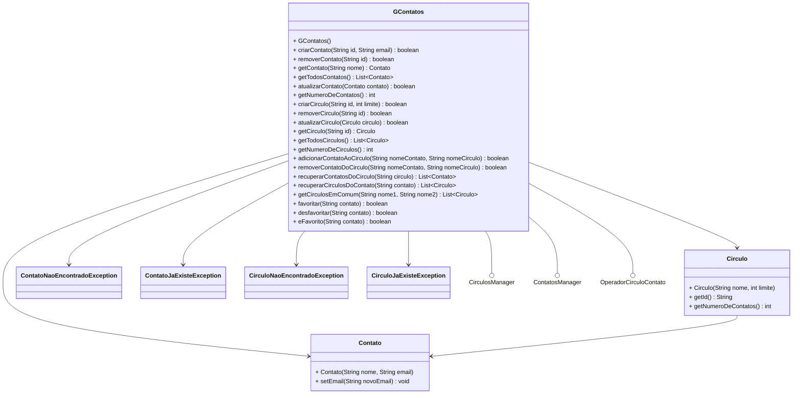

# Círculos
___


<a href="https://br.freepik.com/fotos-gratis/pessoas-segurando-um-icone-do-google-plus_3682503.htm#fromView=keyword&page=1&position=9&uuid=86316aef-16f6-4b0f-abb9-1e98341a7014&query=Google+Plus">Free Pik</a>

> Neste trabalho temos como objetivo implementar um conjunto de classes de modo que elas nos forneçam as funcionalidades 
similares ao conceito de círculos e contatos existentes no finado Google+


## 🎯Requisitos Funcionais

### Contato

 ✅ Adicionar um contato

  - Cada contato possui um identificador único (String) e um email. 
  - Não pode haver dois contatos com o mesmo identificador.

✅ Remover um contato
  - O usuário pode remover um contato informando o seu identificador.

✅ Atualizar email do contato
  - O usuário pode atualizar o email de um contato informando o identificador e o novo email.

✅ Buscar um contato
  - O usuário pode recuperar um contato ao informar seu identificador.

✅ Número de contatos cadastrados
  - O sistema deve retornar a quantidade total de contatos registrados.

✅ Favoritos
  - Deve ser possível favoritar um contato.
  - Deve ser possível desfavoritar um contato.
  - Deve ser possível listar todos os contatos favoritos.
  - Deve ser possível verificar se um contato é favorito.


### Círculos
✅ Criar um círculo
  - Cada círculo possui um identificador único (String) e um limite de armazenamento de contatos.
  - Não pode haver dois círculos com o mesmo identificador.

✅ Remover um círculo
  - O usuário pode remover um círculo ao informar seu identificador.

✅ Atualizar o limite de armazenamento
  - O usuário pode aumentar ou reduzir o limite de contatos de um círculo.

✅ Buscar um círculo
  - O usuário pode recuperar um círculo pelo seu identificador.
  - O usuário pode listar todos os círculos cadastrados.

✅ Número de círculos cadastrados
  - O sistema deve retornar a quantidade total de círculos registrados.

### Relacionamento entre Círculos e Contatos

✅ Adicionar um contato em um círculo
  - Só é possível adicionar contatos se o círculo ainda tiver espaço disponível.
  - Se o contato informado não existir, lançar uma exceção ContatoNaoEncontradoException.
  - Se o círculo informado não existir, lançar uma exceção CirculoNaoEncontradoException.

✅ Remover um contato de um círculo
  - O usuário pode remover um contato de um círculo.
  - Se o contato informado não existir, lançar uma exceção ContatoNaoEncontradoException.
  - Se o círculo informado não existir, lançar uma exceção CirculoNaoEncontradoException.

✅ Listar todos os círculos aos quais um contato pertence
  - Se o contato informado não existir, lançar uma exceção ContatoNaoEncontradoException.

✅ Listar círculos em comum entre dois contatos
  - O sistema deve retornar a lista de círculos em comum entre dois contatos, ordenada alfabeticamente.
  - Se qualquer um dos contatos informados não existir, lançar ContatoNaoEncontradoException.

## 🧱 Diagrama UML

## Exemplo de execução 

````java
    GContatos gcont = new GContatos();

    gcont.adicionarCirculo("familia", 3);
    gcont.adicionarCirculo("amigos", 2);
    gcont.adicionarCirculo("trabalho", 3);
    System.out.println(gcont.listarCirculos()); // [amigos, familia, trabalho]

    gcont.adicionarContato("james", "james@email.com");
    gcont.adicionarContato("mario", "mario@email.com");
    gcont.adicionarContato("jose", "jose@email.com");
    gcont.adicionarContato("ana", "ana@email.com");
    gcont.adicionarContato("joaquim", "joaquim@email.com");
    System.out.println(gcont.listarContatos()); // [ana, james, joaquim, jose, mario]

    gcont.adicionarContatoAoCirculo("mario", "familia");
    System.out.println(gcont.listarCirculosDeContato("mario")); // [familia]

    gcont.adicionarContatoAoCirculo("james", "trabalho");
    gcont.adicionarContatoAoCirculo("joaquim", "trabalho");
    gcont.adicionarContatoAoCirculo("ana", "trabalho");
    System.out.println(gcont.buscarCirculo("trabalho").getContatos()); // [ana, james, joaquim]

    gcont.adicionarContatoAoCirculo("james", "amigos");
    gcont.adicionarContatoAoCirculo("mario", "amigos");
    System.out.println(gcont.buscarCirculo("amigos").getContatos()); // [james, mario]

    System.out.println(gcont.getCirculosEmComum("james", "ana")); // [trabalho]
    System.out.println(gcont.getCirculosEmComum("james", "jose")); // []
    System.out.println(gcont.getCirculosEmComum("james", "mario")); // [amigos]
````